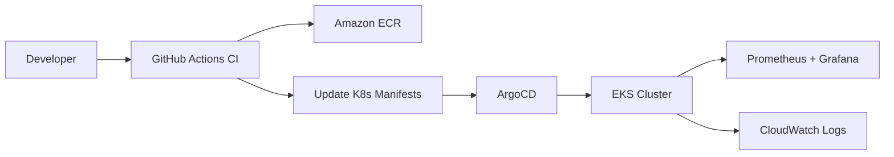

# Boutique — E-Commerce Microservices Platform with AIOps

A 7-service e-commerce application deployed on **AWS EKS** with a full GitOps delivery pipeline, observability stack, and an AI-powered SRE assistant that diagnoses production incidents using live logs, metrics, and cluster health data.

[Architecture](#architecture) · [Highlights](#highlights) · [Tech Stack](#tech-stack) · [Quickstart](#quickstart) · [Engineering Notes](#engineering-notes--known-limitations) · [Troubleshooting Log](#real-incidents--troubleshooting)

---

## Overview

This project takes an e-commerce application — frontend, gateway, auth, product, order, orders, and user services — from a local Docker Compose setup through to a production-style deployment on Kubernetes: containerized, provisioned via Terraform, deployed through GitHub Actions CI, synced with ArgoCD GitOps, and monitored with Prometheus and Grafana.

On top of that operational layer sits **Kira**, an AWS Bedrock-powered SRE agent that can be asked things like *"why are we seeing 503 errors in the last hour?"* and will pull CloudWatch logs, Prometheus metrics, and EKS health data to return a root cause, supporting evidence, and a fix — the same way an on-call engineer would triage an incident.

---

## 🏗️ Architecture

### Architecture Diagram


```
                                    👨‍💻 Developer
                                          │
                                          ▼
                               GitHub Repository
                                          │
                          Push / Pull Request / Merge
                                          │
                                          ▼
                              GitHub Actions CI/CD
              ┌────────────────────────────────────────────┐
              │                                            │
              │ Build Docker Images                        │
              │ Run Tests                                  │
              │ Security Scan                              │
              │ Push Images                                │
              └────────────────────────────────────────────┘
                                          │
                                          ▼
                               Amazon Elastic Container Registry
                                         (ECR)
                                          │
                                          ▼
                                   ArgoCD (GitOps)
                              Watches Kubernetes Manifests
                                          │
                                          ▼
                          Amazon EKS Kubernetes Cluster
┌──────────────────────────────────────────────────────────────────────────────────────────────┐
│                                                                                              │
│   Frontend Deployment                                                                        │
│          │                                                                                   │
│          ▼                                                                                   │
│    API Gateway Service                                                                       │
│          │                                                                                   │
│          ├──────────────► User Service                                                       │
│          │                                                                                   │
│          ├──────────────► Product Service                                                    │
│          │                                                                                   │
│          ├──────────────► Orders Service                                                     │
│          │                                                                                   │
│          └──────────────► Auth Service                                                       │
│                                                                                              │
│                          │                                                                   │
│                          ▼                                                                   │
│                    MySQL StatefulSet                                                         │
│                                                                                              │
└──────────────────────────────────────────────────────────────────────────────────────────────┘
                                          │
                                          ▼
                         Prometheus + ServiceMonitor
                                          │
                                          ▼
                                     Grafana Dashboard
```

###Infrastructure Layer
```
Terraform
     │
     ▼
┌───────────────────────────────┐
│ AWS Infrastructure            │
│                               │
│ • VPC                         │
│ • Public / Private Subnets    │
│ • Internet Gateway            │
│ • NAT Gateway                 │
│ • EKS Cluster                 │
│ • Managed Node Group          │
│ • ECR Repositories            │
│ • IAM Roles                   │
└───────────────────────────────┘

```
```

**Delivery pipeline:** `git push` → GitHub Actions builds & pushes images to ECR → manifest update commit → ArgoCD syncs to EKS.



---

## Highlights

- **7 independently deployable services** — gateway, auth, product, order, orders, user, and a React frontend, each containerized and shipped through the same CI/CD path.
- **AI-powered incident response (Kira)** — a Bedrock Agent with three tool-calling action groups (`fetch_logs`, `fetch_metrics`, `fetch_health`) that follows a structured SRE diagnostic loop: symptom → hypothesis → evidence → root cause → fix recommendation. Backed by Lambda functions querying CloudWatch Logs and Prometheus directly.
- **Modular infrastructure-as-code** — Terraform broken into composable `vpc`, `eks`, `ecr`, and `argocd` modules with explicit dependency chaining, rather than a single monolithic configuration.
- **GitOps delivery with ArgoCD** — declarative Kubernetes manifests managed via Kustomize, with CI responsible only for building images and updating manifest references (no direct `kubectl apply` from the pipeline).
- **Full observability stack** — Prometheus scraping custom `/metrics` endpoints from every service, visualized in Grafana, plus Fluent Bit shipping pod logs to CloudWatch for Kira to query.
- **Documented production debugging** — every infrastructure issue hit during deployment (EKS pod capacity limits, EBS CSI/IRSA permissions, a Postgres init script silently skipping due to a stray `lost+found` directory, missing ServiceMonitor scrape paths) is written up with root cause and fix in [`projects/Issues.md`](projects/Issues.md).

---

## Tech Stack

| Layer | Technology |
|---|---|
| Frontend | React, TypeScript |
| Backend Services | Node.js, Express, TypeScript |
| Database | PostgreSQL |
| Containers | Docker, Docker Compose |
| Orchestration | Kubernetes (AWS EKS) |
| Infrastructure as Code | Terraform (modular: VPC, EKS, ECR, ArgoCD) |
| CI/CD | GitHub Actions |
| GitOps | ArgoCD + Kustomize |
| Observability | Prometheus, Grafana |
| Log Aggregation | AWS Fluent Bit → CloudWatch Logs |

---

## Quickstart

Run the full stack locally with Docker Compose:

```bash
git clone https://github.com/faizan-ab/ecom-microservices-AIOps.git
cd ecom-microservices-AIOps/projects/boutique-microservices
docker-compose -f docker-compose.yml up -d
```

This starts all 7 services plus PostgreSQL, Prometheus, and Grafana.

| Service | Port |
|---|---|
| Frontend | 3000 |
| Gateway | 3001 |
| Grafana | 8080 |
| Prometheus | 9090 |

For the complete path to AWS — Terraform provisioning, EKS deployment, ArgoCD setup, and the observability stack — see the [full deployment guide](projects/README.md).

---


## Engineering Notes & Known Limitations

Documented here deliberately rather than left for a reviewer to discover:

- **Auth service runs in demo mode** — any password is accepted as `"demo"` and session state is held in-memory rather than via JWT. This was a scope decision to keep focus on the infrastructure and AIOps layers; a production version would add JWT-based auth with refresh tokens.
- **No security scanning stage in CI yet** — the current pipeline builds, scans nothing, and pushes to ECR. Adding Trivy (image scanning) and a SAST step is the next planned addition.
- **Secrets are managed as plain Kubernetes Secrets** for this demo environment rather than via a secrets manager (e.g., AWS Secrets Manager + External Secrets Operator) — acceptable for a portfolio cluster, not for production.
- **Deployments don't yet define resource requests/limits or liveness/readiness probes** — directly related to the pod-capacity issue in the troubleshooting log below; this is the next reliability improvement queued for the manifests.

---

## Real Incidents & Troubleshooting

A sample from the full log at [`projects/Issues.md`](projects/Issues.md):

> **Node group hit pod capacity limits under load.** `t3.medium` instances cap out at 17 pods; once monitoring and ArgoCD were added on top of service replicas, the cluster started rejecting new pods. Root cause was instance-type pod density, not a Kubernetes misconfiguration — resolved by moving to `t3.large` (35 pod capacity).

> **Postgres silently skipped database initialization.** The init script that loads the schema dump only runs on an empty EBS volume — but EBS volumes ship with a `lost+found` directory by default, so Postgres saw a "non-empty" volume and skipped init entirely. The pod reported healthy while the application errored with "products page not found." Fixed with a dedicated DB-restore Job run after the Postgres pod is confirmed ready.

See the full document for the EBS/IRSA permission issue and the Grafana metrics-scraping fix as well.

---

## Author

**Mohammed Abdul Faizan** — DevOps Engineer
[GitHub](https://github.com/faizan-ab)


